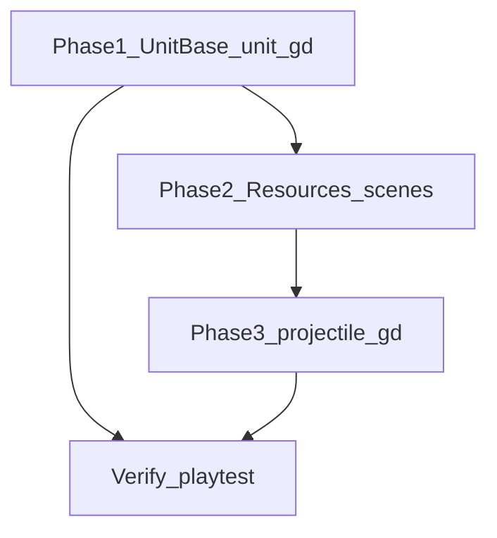

# Merged plan: unit pipeline + complete projectiles

## Why merge

Both plans edit **[scripts/core/unit_base.gd](scripts/core/unit_base.gd)** (`dealt_damage`, `_perform_attack` projectile spawn, signal correctness). Doing **single-unit refactor first** avoids thrashing the same functions twice and ensures `is_attacking` / cooldown behavior is correct before assigning `projectile_scene` in `.tres` files.

---

## Phase 1 — Single-unit logic ([unit_base.gd](scripts/core/unit_base.gd), [unit.gd](scripts/unit.gd))

### Problems currently

- **[scripts/unit.gd](scripts/unit.gd)** overrides `_physics_process` without `super`, so base **cooldown tick** and **walk/idle animation** never run for [unit.tscn](scenes/unit.tscn).
- **Target refresh**: only `unit.gd` calls `find_target()` each frame; `UnitBase` alone never acquires targets.
- `**died` double fire**: `died.connect(_on_died)` re-emits `died` ([unit_base.gd](scripts/core/unit_base.gd) + duplicate handler in unit.gd).
- `**dealt_damage`**: emitted on DIRECT but **not declared** on `UnitBase` (runtime risk); PROJECTILE path is also silent for listeners.
- **Movement**: duplicated inline vs `_move_towards`; magic `5` / `5.0` repeated.
- **Optional**: [behavior_pattern.gd](scripts/core/behavior_pattern.gd) may set `move_to_position` meta — not read by march logic today.

### Target design

1. **One `_physics_process` on `UnitBase`**: alive check → `_tick_attack_cooldown` → `_refresh_target` (`current_target = find_target()`) → `_step_combat_or_march` → `_sync_walk_idle_animation`.
2. **Single `_move_towards(world_pos)`** (drop unused `delta`); constants e.g. `ARRIVAL_DISTANCE`, `MOVING_SPEED_THRESHOLD`.
3. `**_get_march_destination()**` on base (follow-player + optional `move_to_position` + `_get_lane_goal_pos()`); **[unit.gd](scripts/unit.gd)** only overrides to `return _get_lane_goal_pos()` for standard lane units.
4. **Cleanup**: remove `died` self-forward; add `signal dealt_damage`; fix PROJECTILE arm so missing `projectile_scene` does not leave `is_attacking` stuck (restructure `match` / early exit).

### Out of scope here

- **[scripts/archer.gd](scripts/archer.gd)** as separate `CharacterBody2D` stack — migrating to `UnitBase` is a later refactor.

---

## Phase 2 — Wire ranged resources and opponent scene

### Current projectile flow

- Spawn: `UnitBase._perform_attack` → instantiate `projectile_scene`, set position, `target`, `damage`, `team`, parent.
- Flight/hit: [scripts/projectile.gd](scripts/projectile.gd) (distance threshold ~8px); collision mask largely unused for hits.

### Gaps

| Issue                 | Detail                                                                                                                                                                                                                                                                                                 |
| --------------------- | ------------------------------------------------------------------------------------------------------------------------------------------------------------------------------------------------------------------------------------------------------------------------------------------------------ |
| No scene assigned     | [archer.tres](resources/unit_stats/archer.tres), [mage.tres](resources/unit_stats/mage.tres) use `PROJECTILE` but `projectile_scene = null` → early return, no spawn.                                                                                                                                  |
| Opponent scene root   | [opponents_projectile.tscn](scenes/units/projectiles/opponents_projectile.tscn) is `Node2D` with script on child `Area2D` — moving child `global_position` does not move parent visual; align with [allies_projectile.tscn](scenes/units/projectiles/allies_projectile.tscn) (root `Area2D` + script). |
| `dealt_damage` parity | Ranged should notify like DIRECT once Phase 1 adds the signal — either emit from projectile on hit with shooter ref, or connect spawn-time.                                                                                                                                                            |

### Steps

1. Assign `projectile_scene` on archer/mage `.tres` to allies projectile (or dedicated scenes later).
2. After opponent prefab fix, point enemy ranged stats at `opponents_projectile.tscn`.

---

## Phase 3 — Harden [projectile.gd](scripts/projectile.gd)

- Declare `var team: int` (and use for friendly-fire / future collision rules if needed).
- **Max travel distance or lifetime** from spawn → `queue_free()` to avoid infinite flyers when kiting.
- Optional **facing** (`rotation` or sprite flip) toward target.
- **Optional shooter** (`WeakRef` / `Node`) set from `UnitBase` when spawning; on successful `take_damage`, emit `**dealt_damage`** from owner (or signal on projectile connected once).

Optional later: collision-based hits vs homing — towers may stay homing-only until they have `Area2D` hitboxes.

---

## Files touched (combined)

| Area                | Files                                                                                                                                                             |
| ------------------- | ----------------------------------------------------------------------------------------------------------------------------------------------------------------- |
| Unit pipeline       | [scripts/core/unit_base.gd](scripts/core/unit_base.gd), [scripts/unit.gd](scripts/unit.gd)                                                                        |
| Ranged data         | [resources/unit_stats/archer.tres](resources/unit_stats/archer.tres), [resources/unit_stats/mage.tres](resources/unit_stats/mage.tres), enemy stats as applicable |
| Scenes              | [scenes/units/projectiles/opponents_projectile.tscn](scenes/units/projectiles/opponents_projectile.tscn)                                                          |
| Projectile behavior | [scripts/projectile.gd](scripts/projectile.gd)                                                                                                                    |

---

## Success criteria (combined)

- Lane units: one physics path, cooldown + walk/idle work, `**died` once** per death.
- Archer/mage: visible projectiles, impact damage, **no stuck `is_attacking`** when misconfigured.
- Opponent projectile art moves with hitbox.
- Projectiles do not fly forever; tower damage still works via homing `target`.
- `**dealt_damage**` fires for DIRECT and, if implemented, for projectile hits the same as melee for any UI/stats listeners.

---

## Verification

- Playtest spawn: melee timing/anim/death; ranged spawn and hit.
- Grep `dealt_damage` / `died` connections — confirm nothing relied on double `died`.

