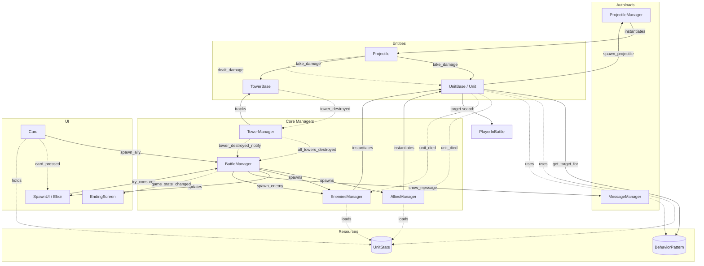

# Godot Battle System: Script Interaction Graph

This graph visualizes how the different scripts and components in the game communicate. It covers core managers, entities, UI, and data resources.

## Legend
- **Solid Lines (-->)**: Direct Method Calls / References
- **Dashed Lines (-.->)**: Signals / Events
- **Cylinders ([( )])**: Resources / Data Containers
- **Rectangles ([ ])**: Nodes / Scripted Objects

## Interaction Graph

## Detailed Signal Registry

| Script | Signal | Triggered When | Primarily Handled By |
| :--- | :--- | :--- | :--- |
| **BattleManager** | `game_state_changed(state)` | Game state transitions to `ready`, `game_over`, etc. | UI components (e.g., `EndingScreen`) |
| **AlliesManager** | `unit_spawned(unit, info)` | A new ally unit is successfully instantiated. | Analytics or debug logs |
| **AlliesManager** | `spawn_failed(reason)` | Spawning failed due to cost or lane issues. | UI Error messages |
| **TowerManager** | `all_towers_destroyed(winner)`| A team's tower count reaches zero. | `BattleManager` |
| **TowerManager** | `tower_destroyed_notify(tower)`| Any tower is removed from the game. | `BattleManager` for win/loss checks |
| **TowerBase** | `tower_destroyed(tower)` | Health reaches zero. | `TowerManager` |
| **UnitBase** | `health_changed(cur, max)` | Unit takes damage. | Attached HealthBar UI |
| **UnitBase** | `died(unit)` | Health reaches zero. | Source container (`AlliesManager`/`EnemiesManager`) |
| **UnitBase** | `dealt_damage(amt, target)`| Unit's attack successfully hits a target. | Combat log or XP systems |
| **SpawnUI** | `elixir_changed(current)` | Elixir regenerates or is consumed. | Self (Internal UI update) |
| **Card** | `card_pressed(card)` | User clicks the card button. | `SpawnUI` for selection state |
| **BattleWorldLink**| `world_data_synced(data)` | Persistent data is updated from the world. | Save system / Progression UI |

## Unused "Dead End" Signals
These signals are currently emitted by the codebase but have no active listeners (connections). They are identified as "unimportant" for the current core loops:

1.  **`dealt_damage`** (UnitBase / Projectile): No combat log/XP system yet.
2.  **`game_state_changed`** (BattleManager): UI transitions are currently handled by direct method calls.
3.  **`tower_destroyed_notify`** (TowerManager): Redundant as logic is handled within the manager.
4.  **`all_towers_destroyed`** (TowerManager): Redundant due to direct calls to `show_ending_screen`.
5.  **`unit_spawned` / `spawn_failed`** (AlliesManager): Not connected to UI or managers.

## Key Interaction Paths

1.  **Unit Spawning Flow**:
    `Card (Button)` --> `BattleManager (Logic)` --> `SpawnUI (Consume Elixir)` --> `AlliesManager (Instantiate)` --> `Unit (Ready)`.
2.  **Combat Loop**:
    `Unit (Detection)` --> `BehaviorPattern (Target)` --> `ProjectileManager (Spawning)` --> `Projectile (Flight)` --> `Victim (Take Damage)`.
3.  **End Game Flow**:
    `Projectile (Hit)` --> `TowerBase (Destroyed)` --> `TowerManager (Update Count)` --> `BattleManager (Game Over)` --> `MessageManager (Show Winner)`.
