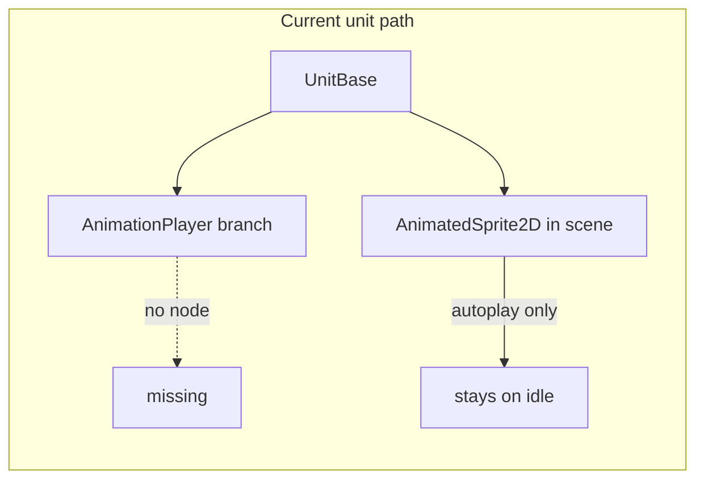

# Unify 2D unit animation around AnimatedSprite2D

## What is wrong today

- `**[important_scripts/unit/unit_base.gd](important_scripts/unit/unit_base.gd)**` updates movement visuals only when `animation_player` exists (`_sync_walk_idle_animation`, attack, die). A repo-wide search shows **no `AnimationPlayer` under `[scenes/](scenes/)`**, so those branches never run for spawned units.
- The same file references `**sprite.texture = stats.unit_texture**` in `_ready()`. `AnimatedSprite2D` in Godot 4 is driven by `**SpriteFrames**`, not a single texture; this line does not match how the node in `[scenes/unit.tscn](scenes/unit.tscn)` is set up (embedded `SpriteFrames` with `idle` / `walk` / `attack` / `die`).
- `**[important_scripts/player_in_battle.gd](important_scripts/player_in_battle.gd)**` already uses the correct pattern: `anim_sprite.play("walk")` / `play("idle")`.

So complexity is not only “many animations” — it is **two parallel systems**, one of which is effectively dead for units.

## Target naming convention

Use a single string per clip, consistent across all unit types:

`{faction}_{archetype}_{action}`

Examples: `ally_archer_idle`, `enemy_mage_attack`, `ally_warrior_die`.

- **Faction / side**: **ally and enemy are separate `UnitStats` resources** (e.g. ally archer vs enemy archer) so health, damage, costs, ranges, and visuals can all differ. Do not assume one shared “archer” tres only flips by `team`; spawn/managers assign the correct stats for that unit.
- **Unit ID on stats**: store an explicit clip prefix on each resource (e.g. `@export var unit_id: String = "ally_archer"`) used to build clip names. **Gameplay `team` stays for targeting/alliances**; it does not have to be the single source of truth for which art set or balance row applies.
- **Archetype**: optional stable id for code/UI (`archer`, `mage`, `warrior`) if you still want it besides the full prefix.
- **Action**: fixed vocabulary: `idle`, `walk`, `attack`, `die` (extend later if needed: `hit`, `spawn`).

This keeps **one `SpriteFrames` resource per character sheet** (or per logical “skin”) with many named animations, which matches your idea of “one animated sprite, many animations.” Ally and enemy sheets can still be one file (many clips) or two different `SpriteFrames` references from their respective stats.

## Recommended data model (`[important_scripts/unit/unit_stats.gd](important_scripts/unit/unit_stats.gd)`)

1. Add `**@export var unit_id: String`** (e.g. `"ally_archer"`, `"enemy_archer"`) used with `_play_action` to form full clip names.
2. **Removed** the four separate `*_animation` string exports (idle_animation, attack_animation, walk_animation, die_animation) from UnitStats and all .tres files.

Maintain **paired tres files** (or clearly named resources) for each role on each side so balance and art stay independent.

## Code changes (single playback path)

In `**UnitBase`** (or a tiny nested helper script if you want separation):

1. `**_animation_base_name() -> String`**: returns `stats.unit_id`.
2. `**_play_action(action: String)`**: builds `unit_id + "_" + action`, checks the clip exists on `sprite.sprite_frames` (e.g. `name in sprite.sprite_frames.get_animation_names()`), then `sprite.play(name)`. If missing, optionally fall back to a generic clip (`idle`) or the legacy short name (`idle`) during migration.
3. Replace `**animation_player` usage** in `_sync_walk_idle_animation`, `_perform_attack`, and `take_damage` with calls to `**_play_action(...)`** when `sprite` is present.
5. **Attack / die timing**: replace fixed `0.3` / `0.5` timers where possible with `**sprite.animation_finished`** for non-looping clips (with a max timeout fallback so gameplay never soft-locks if an anim is missing).

Keep `**animation_player` branches** only if you still have scenes that use them; otherwise remove them to reduce mental load.

## Asset workflow

- **Authoring**: For each unit visual, one `SpriteFrames` `.tres` (or inline in a scene) listing all clips with the full names (`ally_archer_idle`, …). Godot’s SpriteFrames editor supports many animations in one resource.
- **Migration**: Rename clips as needed, set `unit_id` (and separate ally/enemy `.tres` where stats differ), and verify `_play_action` for spawns from `[allies_manager.gd](important_scripts/unit/allies_manager.gd)` / `[enemies_manager.gd](important_scripts/unit/enemies_manager.gd)` (`flip_h` / `look_at` rules stay explicit).

